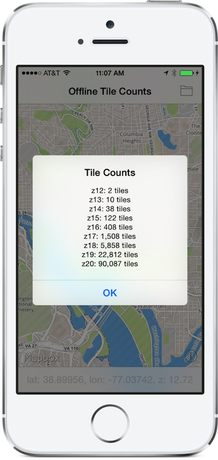

# OfflineCalc

Small utility app to calculate the tile counts needed to go offline. 

Pan and zoom to the desired area, then tap the folder icon to get a dialog showing the total number of tiles needed for the current zoom level to each of the successive zoom levels up to `z20`. 

This screenshot indicates: 

- 2 tiles to take `z12` offline
- 10 tiles to take `z12` & `z13` offline
- ...
- 90,087 tiles to take `z12` through `z20` offline
